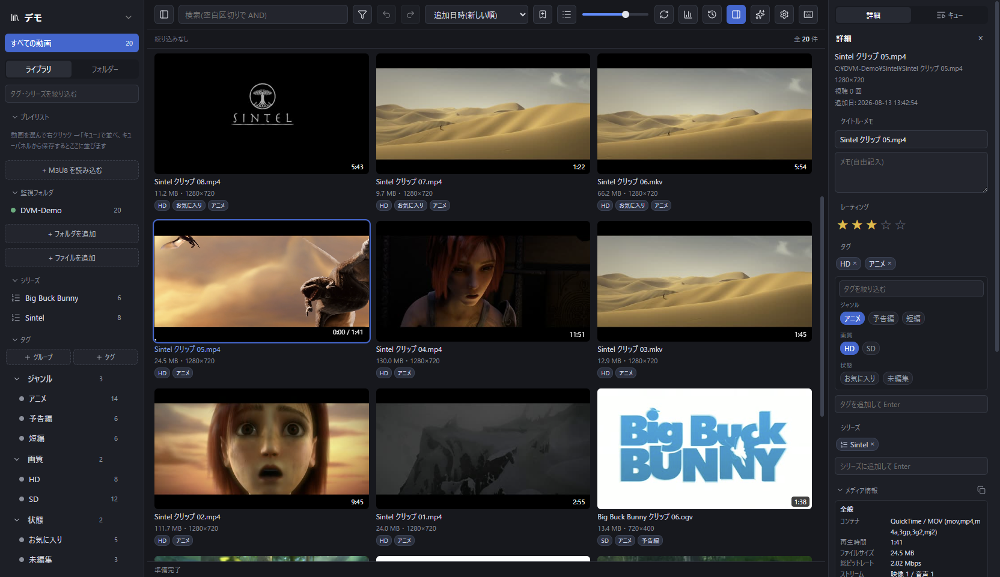
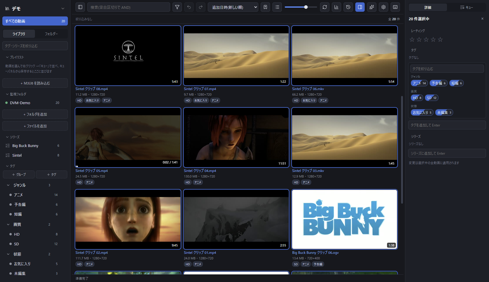
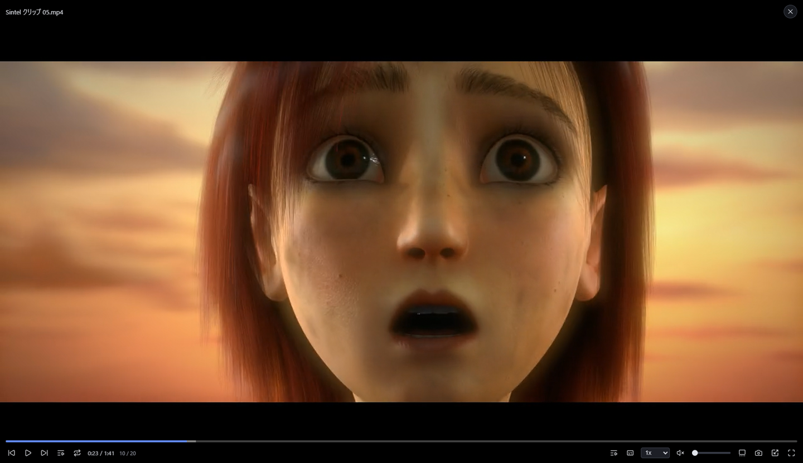

# DVM(Demodemo Video Manager)

Windows 向けの動画管理ソフトです。動画ファイルを**コピーも移動もせず**、元の場所に置いたまま
サムネイル・タグ・シリーズ・評価で整理します。外付け HDD や NAS に置いた大量の動画を
そのまま扱えます。



- サムネイルグリッド(仮想化済みなので数万件でも軽い)
- タグ / タググループ / シリーズ / 評価 / スマートフォルダ
- アプリ内再生(libmpv)、ホバープレビュー、視聴履歴とレジューム
- 重複検出、見つからないファイルの検出と再リンク
- **AI からの操作**(下記)

| タグとシリーズで分類 | libmpv によるアプリ内再生 |
|---|---|
|  |  |

使い方の詳しい説明は **[公式サイト(demo2.jp/dvm)](https://demo2.jp/dvm/)** にあります。

## 動作環境

- Windows 10 / 11(64bit)
- WebView2 ランタイム — Windows 11 には標準で入っています。無い場合はインストーラが自動で入れます

## インストール

[Releases](https://github.com/demodemo0818/dvm/releases) から最新の
`DVM_x.y.z_x64-setup.exe` をダウンロードして実行してください。FFmpeg も MCP サーバーも
同梱されているので、別途用意するものはありません。

> [!IMPORTANT]
> **「WindowsによってPCが保護されました」と出た場合**
>
> コード署名証明書を付けていないため、Windows SmartScreen が警告を出します。
> **「詳細情報」→「実行」** で進めてください。ダウンロードした exe を信用できるか
> 確かめたい場合は、Releases に併記した SHA-256 ハッシュと照合できます。
>
> ```powershell
> Get-FileHash .\DVM_1.43.0_x64-setup.exe
> ```

データベースとサムネイルは「ライブラリフォルダ」(既定は
`%APPDATA%\jp.demo2.dvm\libraries\マイライブラリ`)に保存されます。
動画ファイル自体には触れません。

アンインストールしてもライブラリフォルダは残ります。完全に消したい場合は
`%APPDATA%\jp.demo2.dvm` とライブラリフォルダを手で削除してください。

## 複数のライブラリを使い分ける

用途ごとに中身を完全に分けられます。サイドバー上部のライブラリ名をクリックすると、
切り替え・新規作成・既存のライブラリを開くができます(切り替えるとアプリが再起動します)。

- 動画・タグ・シリーズ・監視フォルダはライブラリごとに分かれます
- 見た目の設定・API キー・外部プレイヤーなどはアプリ全体で共有されます
- 置き場所は自由に選べます。**外付け HDD に置けば、ドライブごと別の PC に持ち運べます**
  (別の PC では「既存のライブラリを開く」から選びます)
- AI(MCP)が見るのは、いま DVM で開いているライブラリです。切り替えても
  AI 側の設定を変える必要はありません

## AI から操作する

DVM には AI 連携の入口が 2 つあります。**既に契約している AI アプリ(Claude Pro / Max など)
をそのまま使いたい場合は MCP のほうを選んでください。**

| | MCP 連携 | アプリ内 AI アシスタント |
|---|---|---|
| 使う場所 | Claude Desktop など別のアプリ | DVM のツールバー ✨ |
| 必要なもの | 対応 AI アプリ(サブスクで可) | API キー(従量課金)またはローカル LLM |
| 使える AI | MCP 対応クライアント全般 | Claude / GPT / Gemini / OpenAI 互換 |
| DVM の起動 | 不要 | 必要 |
| できること | 検索・統計・タグ付け・評価・シリーズ整理 | 左に同じ + 画面のグリッドを直接絞り込む |

### MCP の設定(推奨)

DVM の **設定 → MCP 連携** を開くと、お使いのアプリに貼り付ける内容がそのまま出ます。
コピーボタンを押して貼り付けるだけです。

- **Claude Desktop** — 設定 → 開発者 → 「構成を編集」で設定ファイルを開き、
  表示された JSON を貼り付けて再起動します(ファイルの場所はアプリによって違うので、
  自分でパスを探すより「構成を編集」から開くほうが確実です)
- **Claude Code** — 表示されたコマンド(`claude mcp add dvm -s user -- "..."`)を
  PowerShell に貼り付けて実行します
- **その他**(Cursor / Cline / VS Code など)— 同じ `mcpServers` 形式の JSON が使えます

> **JSON を貼り付けるときの注意**: 設定ファイルに既に中身がある場合、貼り付ける直前の行の
> 末尾に `,` が要ります。これが抜けると JSON として壊れ、**AI アプリ自体が起動時に
> エラーになります**(MCP が動かないのではなく、アプリが設定を読めなくなります)。
>
> ```json
>   "既存の設定": "値",          ← このカンマを忘れない
>   "mcpServers": { ... }
> ```

設定できたら、AI にこんなふうに話しかけられます。

- 「ライブラリの統計を見せて」
- 「タグが付いてない動画を 20 件教えて」
- 「FHD 以上で 30 分を超える未視聴の動画を探して」
- 「内容が重複してる動画ある?」

**既定では読み取り専用です。** データベースを読み取り専用で開くため、AI がライブラリを
変更することは構造的にできません。設定画面の「AI からの変更を許可する」をオンにすると、
タグ・評価・シリーズの編集もできるようになります(変更はすべて操作履歴に `ai` として残ります)。
ファイルをごみ箱へ送る操作だけは、オンにしても必ず対象一覧の確認を挟みます。

DB の場所を変えている場合は、設定に環境変数 `DVM_DB` でフルパスを指定してください。

### アプリ内 AI アシスタント

設定 → AI 連携 で使う AI を選び、その API キーを入れると、ツールバーの ✨ から使えるように
なります。自然言語での検索結果をそのままグリッドに反映できるのがこちらの利点です。

| 選べる AI | 必要なもの | 既定のモデル |
|---|---|---|
| Anthropic (Claude) | `sk-ant-...`([console.anthropic.com](https://console.anthropic.com)) | `claude-opus-5` |
| OpenAI (GPT) | `sk-...`([platform.openai.com](https://platform.openai.com)) | `gpt-5` |
| Google Gemini | `AIza...`([aistudio.google.com](https://aistudio.google.com)) | `gemini-2.5-pro` |
| OpenAI 互換 | ベース URL(+ 必要ならキー) | 自分で指定 |

**サブスクリプション(Claude Pro / Max、ChatGPT Plus など)では使えません** —— どの会社も
API は従量課金の別契約です。サブスクのまま使いたい場合は上の MCP 連携をお使いください。

「OpenAI 互換」を選ぶと、OpenRouter・Ollama・LM Studio など OpenAI 互換の API を持つ
サービスやローカル LLM に繋げます。**ローカル LLM なら API 料金はかかりません**
(ベース URL のプリセットボタンから選べます)。

モデルは候補から選べますが手入力もできます。費用を抑えたいときは `claude-haiku-4-5` や
`gpt-5-mini`、`gemini-2.5-flash` などに変更してください。

> [!WARNING]
> **API キーは暗号化されずに保存されます。** `%APPDATA%\jp.demo2.dvm\app.db` に平文で
> 入るため、その PC を使える人はキーを読み出せます。共用 PC では使わないでください
> (Windows DPAPI での保護は今後の課題です)。

## 開発

初回だけ、同梱するバイナリを揃えます。**これをやらないと `cargo` のビルドが
「resource path ... doesn't exist」で止まります**(`tauri.conf.json` の `bundle.resources` に
書いてあるファイルの実在をビルドスクリプトが確認するため)。

```powershell
npm install
powershell -ExecutionPolicy Bypass -File scripts/fetch-ffmpeg.ps1
npx tauri-plugin-libmpv-api setup-lib
npm run build:mcp -- -Config debug   # 開発用。配布ビルドでは release 版が自動で作られる
```

あとは通常どおり起動できます。

```powershell
npm run tauri dev
```

| コマンド | 内容 |
|---|---|
| `npm run tauri dev` | 開発起動(フロント HMR + Rust 自動再ビルド) |
| `npm run tauri build` | 配布ビルド(MCP サーバーのビルドと同梱まで自動) |
| `npm run build:mcp` | MCP サーバーだけをビルドして `src-tauri/binaries/` に配置 |
| `npm run test` | フロントの純関数テスト(vitest) |
| `cd src-tauri && cargo test` | コアロジックのテスト |
| `cd src-tauri && cargo check` | Rust の型チェック |

設計の全体像・データモデル・ロードマップは [docs/DESIGN.md](docs/DESIGN.md) にあります。

## ライセンス

**GPL-3.0-or-later**([LICENSE](LICENSE))。

GPL を選んでいるのは、サムネイル生成と変換に使う **FFmpeg を GPL ビルドのまま同梱している**
ためです。同梱している FFmpeg / libmpv のライセンスとソース入手先は
[THIRD-PARTY-NOTICES.md](THIRD-PARTY-NOTICES.md) にまとめてあります。

Copyright (C) 2026 demodemo

このプログラムはフリーソフトウェアです。**まったく無保証**です。詳しくは
GNU General Public License をお読みください。
